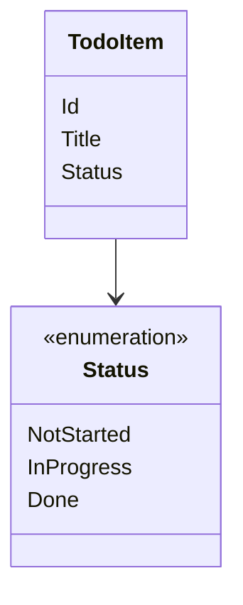

data Todoアイテム(R) =
	Id
	AND タイトル

data ステータス(R) =
	未着手
	OR 着手中
	OR 完了

data Todo作成(E) =
	TodoアイテムId
	AND 作成日時

data Todo着手(E) =
	TodoアイテムId
	AND 着手日時

data Todo完了(E) =
	TodoアイテムId
	AND 完了日時

```mermaid
classDiagram
	class TodoItem {
		Id
		Title
		Status
	}

	class Status {
		<<enumeration>>
		NotStarted
		InProgress
		Done
	}

	TodoItem --> Status
```
